```py
Nama  : Muhamad Ali M
Nim   : 312210540
Kelas : TI.22.B2
```

# TUGAS

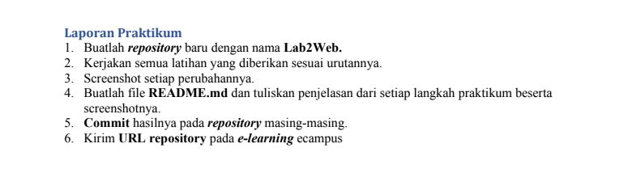

# Memulai PHP”

Buat folder lab2_php_dasar pada root directory web server (d:\xampp\htdocs)

OUTPUT

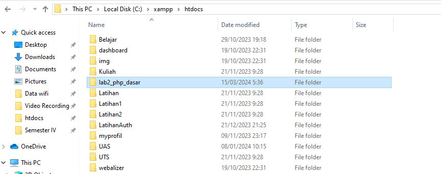

Kemudian untuk mengakses direktory tersebut pada web server dengan mengakses URL:
http://localhost/lab2_php_dasar/

OUTPUT

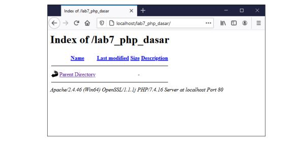

# PHP Dasar

Buat file baru dengan nama php_dasar.php pada directory tersebut. Kemudian buat kode seperti
berikut.

```py
<!DOCTYPE html>
<html lang="en">
<head>
<meta charset="UTF-8">
<title>PHP Dasar</title>
</head>
<body>
<h1>Belajar PHP Dasar</h1>
<?php
echo "Hello World";
?>
</body>
</html>
```

Kemudian untuk mengakses hasilnya melalui URL: http://127.0.0.1/lab2_php_dasar/php_dasar.php

OUTPUT

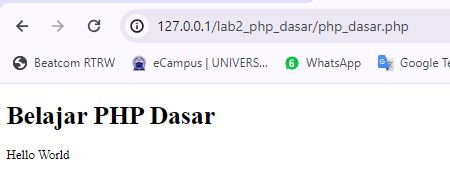

# Variable PHP

Menambahkan variable pada program.

```py
<?php
$nim = "312210540";
$nama = 'Muhamad Ali M';
echo "NIM : " . $nim . "<br>";
echo "Nama : $nama";
?>
```

OUTPUT

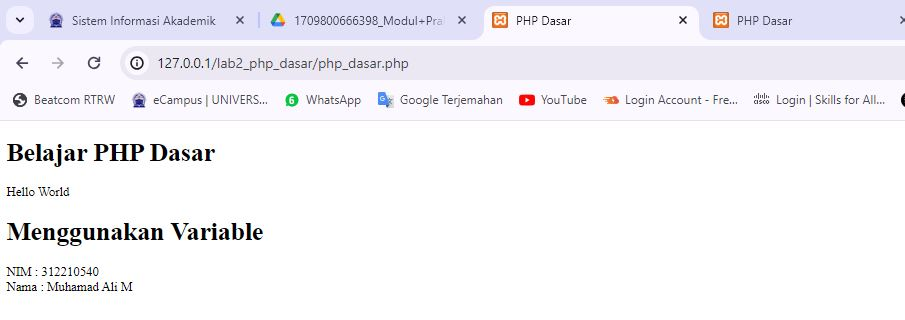

# Predefine Variable $\_GET

```py
<?php
echo 'Selamat Datang ' . $_GET['nama'];
?>
```

# Membuat Form Input

```py
<!DOCTYPE html>
<html lang="en">
<head>
<meta charset="UTF-8">
<title>PHP Dasar</title>
</head>
<body>
<h2>Form Input</h2>
<form method="post">
<label>Nama: </label>
<input type="text" name="nama">
<input type="submit" value="Kirim">
</form>
<?php
echo 'Selamat Datang ' . $_POST['nama'];
?>
</body>
</html>
```

OUTPUT

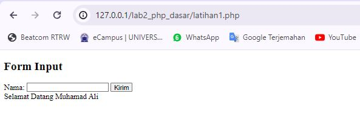

### Modul Praktikum Pemrograman Web 2

# Operator

```py
<?php
$gaji = 1000000;
$pajak = 0.1;
$thp = $gaji - ($gaji*$pajak);
echo "Gaji sebelum pajak = Rp. $gaji <br>";
echo "Gaji yang dibawa pulang = Rp. $thp";
?>
```

OUTPUT

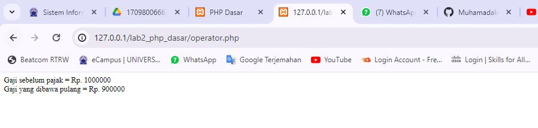

# Kondisi IF

```py
<?php
$nama_hari = date("l");
if ($nama_hari == "Sunday") {
echo "Minggu";
} elseif ($nama_hari == "Monday") {
echo "Senin";
} else {
echo "Selasa";
}
?>
```

OUTPUT

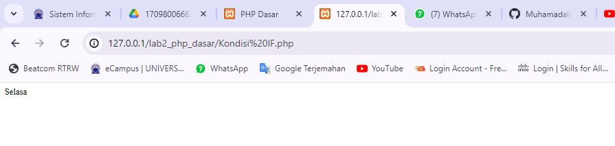

# Kondisi Switch

```py
<?php
$nama_hari = date("l");
switch ($nama_hari) {
case "Sunday":
echo "Minggu";
break;
case "Monday":
echo "Senin";
break;
case "Tuesday":
echo "Selasa";
break;
default:
echo "Sabtu";
}
?>
```

OUTPUT

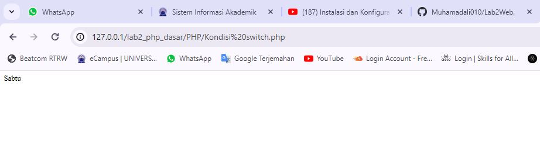

# Perulangan for

```py
<?php
echo "Perulangan 1 sampai 10 <br />";
for ($i=1; $i<=10; $i++) {
echo "Perulangan ke: " . $i . '<br />';
}
echo "Perulangan Menurun dari 10 ke 1 <br />";
for ($i=10; $i>=1; $i--) {
echo "Perulangan ke: " . $i . '<br />';
}
?>
```

OUTPUT

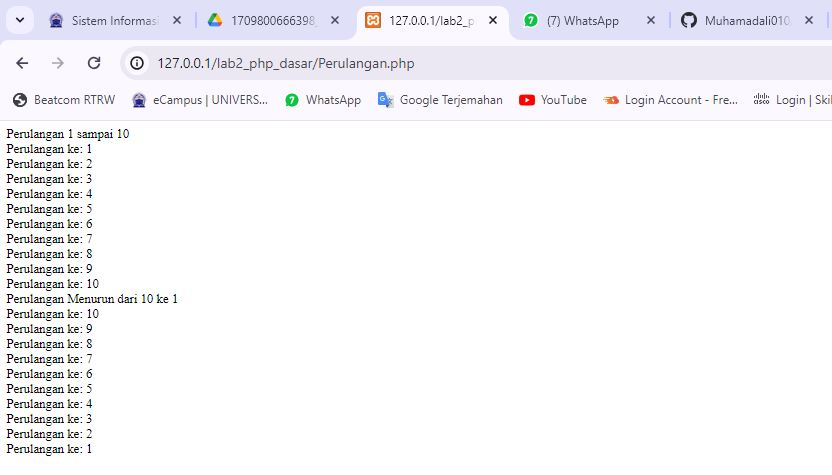

# Perulangan while

```py
<?php
echo "Perulangan 1 sampai 10 <br />";
$i=1;
while ($i<=10) {
echo "Perulangan ke: " . $i . '<br />';
$i++;
}
?>
```

OUTPUT

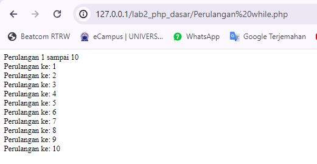

# Perulangan dowhile

```py
<?php
echo "Perulangan 1 sampai 10 <br />";
$i=1;
do {
echo "Perulangan ke: " . $i . '<br />';
$i++;
} while ($i<=10);
?>
```

OUTPUT

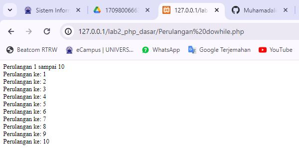

# Membuat Pertanyaan & Tugas

Buatlah program PHP sederhana dengan menggunakan form input yang menampilkan nama, tanggal
lahir dan pekerjaan. Kemudian tampilkan outputnya dengan menghitung umur berdasarkan inputan
tanggal lahir. Dan pilihan pekerjaan dengan gaji yang berbeda-beda sesuai pilihan pekerjaan.

Coba input sourcode berikut:

```py
<!DOCTYPE html>
<html lang="en">
<head>
<meta charset="UTF-8">
<meta name="viewport" content="width=device-width, initial-scale=1.0">
<title>Hitung Umur dan Gaji</title>
</head>
<body>

<?php
// Fungsi untuk menghitung umur berdasarkan tanggal lahir
function hitungUmur($tanggal_lahir) {
    $tgl_lahir = new DateTime($tanggal_lahir);
    $today = new DateTime('today');
    $umur = $today->diff($tgl_lahir)->y;
    return $umur;
}

// Fungsi untuk menampilkan gaji berdasarkan pekerjaan
function hitungGaji($pekerjaan) {
    switch ($pekerjaan) {
        case 'Pegawai':
            return 5000000;
            break;
        case 'Manager':
            return 15000000;
            break;
        case 'Direktur':
            return 20000000;
            break;
        default:
            return 0;
            break;
    }
}

// Memproses form jika telah disubmit
if ($_SERVER["REQUEST_METHOD"] == "POST") {
    $nama = $_POST["nama"];
    $tanggal_lahir = $_POST["tanggal_lahir"];
    $pekerjaan = $_POST["pekerjaan"];

    // Hitung umur berdasarkan tanggal lahir
    $umur = hitungUmur($tanggal_lahir);

    // Hitung gaji berdasarkan pekerjaan
    $gaji = hitungGaji($pekerjaan);

    // Tampilkan output
    echo "<h2>Output:</h2>";
    echo "<p>Nama: $nama</p>";
    echo "<p>Umur: $umur tahun</p>";
    echo "<p>Pekerjaan: $pekerjaan</p>";
    echo "<p>Gaji: Rp " . number_format($gaji, 0, ',', '.') . "</p>";
}
?>

<h2>Form Input</h2>
<form method="post" action="<?php echo htmlspecialchars($_SERVER["PHP_SELF"]);?>">
    <label for="nama">Nama:</label><br>
    <input type="text" id="nama" name="nama" required><br><br>
    <label for="tanggal_lahir">Tanggal Lahir:</label><br>
    <input type="date" id="tanggal_lahir" name="tanggal_lahir" required><br><br>
    <label for="pekerjaan">Pekerjaan:</label><br>
    <select id="pekerjaan" name="pekerjaan" required>
        <option value="Pegawai">Pegawai</option>
        <option value="Manager">Manager</option>
        <option value="Direktur">Direktur</option>
    </select><br><br>
    <input type="submit" value="Submit">
</form>

</body>
</html>
```

# INPUT


# OUTPUT

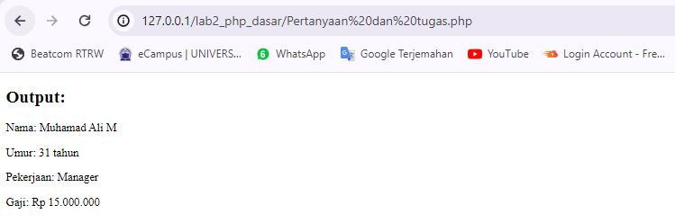

.

=== SEKIAN & TERIMA KASIH ===
