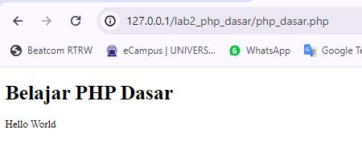
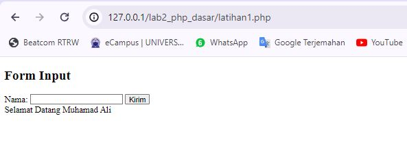

```py
Nama  : Muhamad Ali M
Nim   : 312210540
Kelas : TI.22.B2
```

# Memulai PHP”

Buat folder lab2_php_dasar pada root directory web server (d:\xampp\htdocs)


Kemudian untuk mengakses direktory tersebut pada web server dengan mengakses URL:
http://localhost/lab2_php_dasar/


# PHP Dasar

Buat file baru dengan nama php_dasar.php pada directory tersebut. Kemudian buat kode seperti
berikut.

```py
<!DOCTYPE html>
<html lang="en">
<head>
<meta charset="UTF-8">
<title>PHP Dasar</title>
</head>
<body>
<h1>Belajar PHP Dasar</h1>
<?php
echo "Hello World";
?>
</body>
</html>
```

Kemudian untuk mengakses hasilnya melalui URL: http://127.0.0.1/lab2_php_dasar/php_dasar.php


# Variable PHP

Menambahkan variable pada program.

```py
<?php
$nim = "312210540";
$nama = 'Muhamad Ali M';
echo "NIM : " . $nim . "<br>";
echo "Nama : $nama";
?>
```



# Predefine Variable $\_GET

```py
<?php
echo 'Selamat Datang ' . $_GET['nama'];
?>
```

# Membuat Form Input

```py
<!DOCTYPE html>
<html lang="en">
<head>
<meta charset="UTF-8">
<title>PHP Dasar</title>
</head>
<body>
<h2>Form Input</h2>
<form method="post">
<label>Nama: </label>
<input type="text" name="nama">
<input type="submit" value="Kirim">
</form>
<?php
echo 'Selamat Datang ' . $_POST['nama'];
?>
</body>
</html>
```


